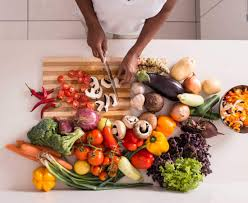

# CFG-Assignments

#### CFG Homework

## About Me

I am  a **Chemical Engineering graduate** with an interest in **Data Analytics** and **Cybersecurity**, over the years I have done different courses to gain new skills and get more job opportunities.

In 2023, I completed a Google course in **Cybersecurity**, it was a bit challenging to balance work with this course as I had other commitments, but I was able to make a plan and organise my time appropriately so I don't get overwhelmed.I Completed this degree and got a certificate to show my completion. 

I am also currently doing a work based apprenticeship in **Data Analytics** and did a MOOC in **IA & Security**, which further peaked my interest in tech.
___
## Skills
- **Technical**: Cybersecurity Fundamentals,troubleshooting 
- **Soft skills**: Analytical thinking skills, Collaboration, Communication, Attention to Detail
- **Certifications**: CompTIA Security+ (in progress), 

___
## Using GitHub
 I plan on using GitHub:
1. To create a professional Portfolio
2. To collaborate with other people 
3. To continue to learn and gain new skills 
___

## Hobbies and Interests 
Some of my hobbies and interests include; cooking for friends and family and also hosting people for small gatherings.I enjoy going to the gym as it gives me a form of clarity and peace of mind and I love to travel when I get the time as it's also an escape from my busy schedule and most importantly I enjoy experiencing new cultures and meeting new people.

| Cooking                                                                | Gym                                                            |                               Travel                                |
|:-----------------------------------------------------------------------|:---------------------------------------------------------------|:-------------------------------------------------------------------:|
|  |  |   |

 

